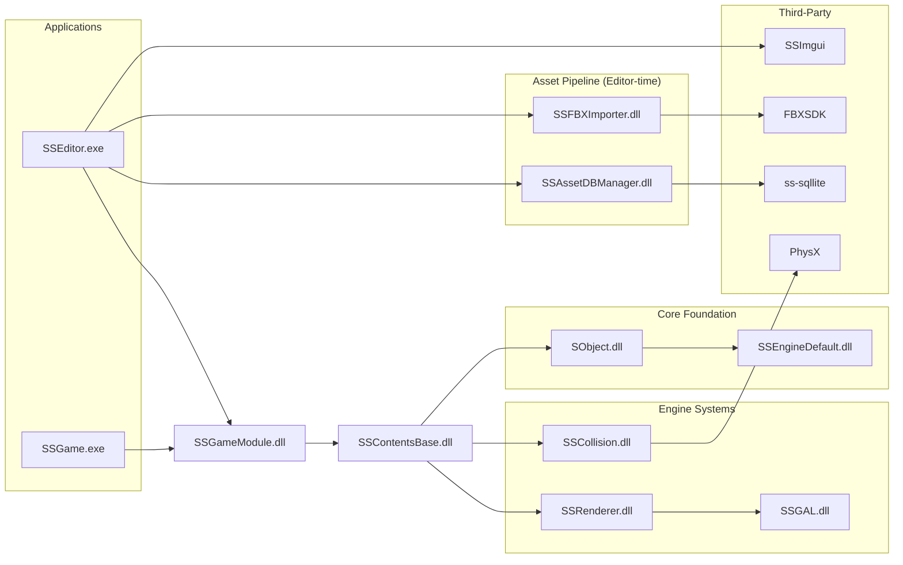

# SSEngine Architecture

## Overview

SSEngine is a personal game engine designed by merging the strengths of Unity and Unreal Engine into a single, production-quality codebase. The engine is structured as a set of independently built DLL modules, each with a clear responsibility and a minimal public interface. Targeting cross-platform compatibility is a long-term goal; the current implementation runs on Windows x64 with DirectX 12.

For coding conventions and build instructions, see [CLAUDE.md](CLAUDE.md).

---

## Module Dependency Diagram



---

## Engine Modules

| Module | Role |
|---|---|
| `SSEngineDefault.dll` | Primitive types, containers, and math functions shared across the entire engine |
| `SObject.dll` | Issues unique 64-bit IDs (`SObjHashCode`) for content-level objects; provides delegate and lifecycle management. Roughly analogous to UObject in Unreal Engine |
| `SSGAL.dll` | Abstracts graphics API-specific resources and functionality, exposing them to the Renderer (DirectX 12) |
| `SSRenderer.dll` | Manages render passes, render object instances, and the renderable context of the current World; owns all render asset types (`IMeshAsset`, `IMaterialAsset`, etc.) |
| `SSCollision.dll` | Handles collision detection, object movement, physics simulation, and overlap queries (PhysX-based) |
| `SSContentsBase.dll` | Abstracts rendering and physics features into a content-friendly interface (`SGameObject`, `SComponentBase`, `SWorld`) |
| `SSGameModule.dll` | The module where actual game content is authored, using features exposed by ContentsBase and other engine layers |
| `SSAssetDBManager.dll` | Manages the project asset list using SQLite; primary purpose is hiding SQLite internals from the rest of the engine |
| `SSFBXImporter.dll` | Converts FBX files to the engine's internal asset format using FBXSDK; encapsulates FBXSDK internals |

## Third-Party Modules

| Module | Role |
|---|---|
| `PhysX` | NVIDIA PhysX for physics and collision. CPU-only mode (no CUDA) |
| `ss-sqllite` | Custom-built SQLite for asset and content data management |
| `SSImgui` | Custom-built Dear ImGui for editor UI |
| `ExternLibs/FBXSDK` | FBXSDK 2020.3.4 for model importing |

## Executables

| Module | Role |
|---|---|
| `SSEditor.exe` | Windows message loop entry point. Editor features and ImGui are implemented directly inside this project |
| `SSGame.exe` | Windows message loop entry point for shipping. All editor features are stripped out |

---

## Key Data Flows

### Transform Commit

Transform Commit is the step that recalculates world-space transform matrices for all objects that moved during a frame. It traverses the scene hierarchy **top-down**, propagating parent transforms to children (including bone hierarchies), so that both the renderer and the physics system always work with up-to-date world transforms.

It runs **twice per frame**:

```
Frame start
  │
  ├─ [Game Logic / Component PerFrame]
  │
  ├─ Transform Commit #1  ← sync before physics
  │     └─ SWorld::ProcessTransformCommit()
  │          └─ for each dirty SGameObject
  │               └─ CalcWorldTransformMatrix()  (top-down, parent → children → bones)
  │                    ├─ ICollInstanceBase::SyncWorldTransform_ByContent()
  │                    └─ IRigidBodyBase pose updated
  │
  ├─ [Physics Simulation]  (PhysX SimulateMovement)
  │     └─ RigidBody results written back → SGameObject transform updated
  │
  ├─ Transform Commit #2  ← sync before render
  │     └─ SWorld::ProcessTransformCommit()
  │          └─ for each dirty SGameObject
  │               └─ CalcWorldTransformMatrix()  (top-down, parent → children → bones)
  │                    └─ IRenderInstance::SetWorldTransformMatrix()
  │
  └─ [Render]  (IRenderer::PerFrame → DirectX 12)
```

---

### Rendering Pipeline (per frame)

```
SGameObject
  └─ SRenderComponentBase::OnGameObjectTransformCommited()
       └─ IRenderInstance::SetWorldTransformMatrix()
            └─ IRenderWorld  →  SSGAL (GALRWMetaData)
                 └─ IRenderer::PerFrame()  →  DirectX 12
```

### Physics Pipeline (per frame, bidirectional)

```
Logic → Physics:
  SGameObject::CommitTransform()
    └─ ICollInstanceBase::SyncWorldTransform_ByContent()
         └─ ICollisionWorld::SimulateMovement()  [PhysX]

Physics → Logic:
  ICollisionWorld::OnEndSimulation()
    └─ IRigidBodyBase::SimulatedPosDelta / SimulatedRotDelta
         └─ SRigidBodyBaseComponent::PostCollision_SyncTransform()
              └─ SGameObject::SetWorldTransform()
```

### Asset Pipeline — Editor time

```
.fbx file
  └─ ISSFBXImporter::GenerateImportedAssets()
       └─ IMeshAsset / IMaterialAsset / IRenderAnimAsset
            └─ IAssetDBLoader::SaveInterAssetsToDB()  →  disk (.apak)
```

### Asset Pipeline — Runtime

```
disk (.apak)
  └─ IAssetDBLoader::LoadAllAssetDataFromDB()
       └─ IAssetManager  (read-only)
            └─ SMeshRenderComponentBase::SetModelAsset(assetName)
                 └─ IRenderInstance  ←  asset bound
```

---

## Cross-Module Object Identity: SObjHashCode

`SObjHashCode` (defined in `SObject`) is a 64-bit unique identifier issued to every `SObjectBase`-derived object. It serves as the primary cross-module reference mechanism, avoiding direct pointer dependencies between modules.

**How it is used:**

- `IRenderInstance`, `ICollInstanceBase`, and `IRigidBodyBase` each store the `SObjHashCode` of their owning `SGameObject`
- `SWorld`, `IRenderWorld`, and `ICollisionWorld` all use `HashMap<SObjHashCode, T*>` as their primary lookup structure
- `SObjHashCode::GetSObject()` allows reverse lookup from any module back to the original `SObjectBase` instance without including content-layer headers

---

## Editor vs. Runtime

| Module | Editor | Runtime |
|---|:---:|:---:|
| `SSFBXImporter` | ✅ (import FBX files) | ❌ |
| `SSAssetDBManager` | ✅ (save/load assets) | ✅ (load only, via `IAssetManager`) |
| `IAssetManagerMutable` | ✅ | ❌ |
| `SSImgui` | ✅ | ❌ |
| All other engine modules | ✅ | ✅ |
